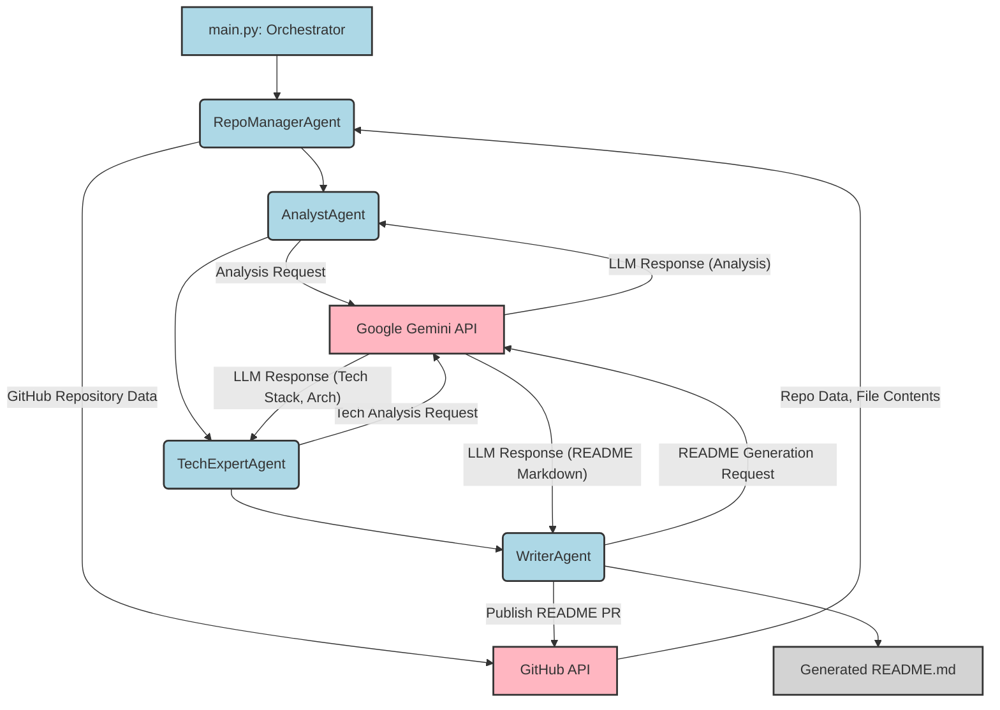

# Agent: AI 기반 README 자동 생성 시스템

본 프로젝트는 GitHub 저장소를 분석하고 이해하여, 해당 프로젝트에 대한 README.md 파일을 자동으로 생성하는 AI 에이전트 기반 시스템입니다. 복잡한 코드베이스의 핵심을 파악하고, 기술 스택을 식별하며, 시스템 아키텍처를 도식화하는 과정을 자동화함으로써 개발자의 문서화 부담을 줄이고, 일관되고 상세한 프로젝트 설명을 제공하는 것을 목표로 합니다. 특히 면접이나 포트폴리오 제출 시 필요한 수준의 고품질 README 문서를 빠르게 생성할 수 있도록 설계되었습니다.

## 주요 기능

*   **GitHub 저장소 분석 및 핵심 파일 선별**: GitHub API를 통해 저장소의 파일 구조와 내용을 가져와 프로젝트 분석에 필요한 핵심 파일들을 지능적으로 선별합니다.
*   **LLM 기반 프로젝트 분석**: Google Gemini API를 활용하여 프로젝트의 목적, 상세 기능, 디렉토리 구조, 그리고 핵심 파일의 역할을 심층적으로 분석하고 구조화된 정보로 요약합니다.
*   **기술 스택 파악 및 아키텍처 도식화**: 분석된 프로젝트 정보를 바탕으로 사용된 기술 스택을 정확히 파악하고, 시스템 아키텍처를 Mermaid.js 코드로 자동 생성하여 시각적인 이해를 돕습니다.
*   **README.md 자동 생성**: 모든 분석 결과를 통합하여 최종 README.md 마크다운 텍스트를 생성하며, 필수 섹션 포함 여부를 검증하여 완성도 높은 문서를 제공합니다.
*   **(추정) GitHub Pull Request 발행**: 생성된 README.md 파일을 GitHub 저장소에 Pull Request 형태로 발행하여 문서화 과정을 자동화합니다.

## 프로젝트 구조

본 프로젝트는 여러 AI 에이전트와 유틸리티 모듈로 구성된 파이프라인 형태의 시스템입니다. `main.py` 스크립트가 전체 워크플로우를 오케스트레이션하며, 각 에이전트는 특정 역할을 순차적으로 수행합니다.

*   `main.py`: 프로젝트의 전체 실행 흐름을 제어하는 메인 스크립트
*   `agents/`: 각 에이전트의 구현 파일들을 포함하는 디렉토리
*   `tools/`: GitHub API 연동, 데이터 파싱 등 공통 유틸리티 함수들을 포함하는 디렉토리
*   `agents/prompts/`: LLM과의 상호작용에 사용되는 프롬프트 템플릿들을 포함하는 디렉토리

## 핵심 파일 설명

이 프로젝트의 핵심 파일과 그 역할은 다음과 같습니다:

*   `main.py`: 프로젝트의 전체 실행 흐름을 제어하는 메인 스크립트입니다. 환경 변수를 로드하고, 각 에이전트를 순서대로 호출하여 GitHub 저장소 분석부터 README 생성까지의 파이프라인을 구동합니다.
*   `agents/repo_manager.py` (`RepoManagerAgent`): GitHub API를 통해 저장소의 파일 트리와 내용을 가져오고, LLM을 활용해 분석에 필요한 핵심 파일들을 선별하는 역할을 담당합니다. (추정) 생성된 README.md를 GitHub에 Pull Request로 발행하는 기능도 포함하고 있습니다.
*   `agents/analyst.py` (`AnalystAgent`): `RepoManagerAgent`로부터 전달받은 저장소 데이터를 기반으로 프로젝트의 목적, 디렉토리 구조, 주요 기능, 핵심 파일 역할을 분석하여 구조화된 JSON 형태로 요약하는 핵심 에이전트입니다.
*   `agents/tech_expert.py` (`TechExpertAgent`): `AnalystAgent`의 분석 결과를 바탕으로 프로젝트의 기술 스택을 파악하고, 각 기술의 이점을 설명하며, 시스템 아키텍처를 Mermaid.js 코드로 도식화하는 역할을 합니다.
*   `agents/writers.py` (`WriterAgent`): 모든 에이전트의 최종 분석 결과를 취합하여 최종 README.md 마크다운 텍스트를 생성하고, 이를 파일로 저장하며, 생성된 README의 필수 섹션 포함 여부를 검증합니다.
*   `tools/github_api.py`: GitHub API와 연동하여 저장소 정보 조회, 파일 내용 가져오기, Pull Request 생성 등 GitHub 관련 작업을 처리하는 유틸리티 함수들을 모아둔 모듈입니다.
*   `tools/parser.py`: 파일 경로 목록을 분석하여 저장소 구조를 요약하고, 핵심 파일 후보를 선정하며, LLM에 전달할 분석 컨텍스트를 구성하는 등 데이터 파싱 및 전처리 기능을 제공합니다.
*   `agents/prompts/*.py` (예: `repo_manager_prompt.py`, `analyst.py` 내의 `ANALYST_INSTRUCTION`, `tech_expert_prompt.py`): 각 에이전트가 LLM과 상호작용할 때 사용되는 지시문(프롬프트) 템플릿을 정의합니다. 이 프롬프트들은 LLM이 특정 작업을 수행하고 원하는 형식의 출력을 생성하도록 유도하는 데 결정적인 역할을 합니다.

## 기술 스택

본 프로젝트는 다음과 같은 기술 스택으로 개발되었습니다.

*   **Backend**:
    *   **Python**: 간결하고 강력한 문법으로 빠른 개발이 가능하며, 다양한 라이브러리를 활용하여 복잡한 로직 구현에 용이합니다.
    *   **Google Gemini API**: 최신 대규모 언어 모델을 활용하여 복잡한 코드 분석, 아키텍처 요약 등 고급 AI 기능을 효율적으로 통합할 수 있습니다.
    *   **PyGithub**: GitHub API를 Python으로 쉽게 조작하여 저장소의 코드, 구조, 메타데이터에 프로그래밍 방식으로 접근하고 자동화된 리포지토리 관리 기능을 구현할 수 있습니다.
*   **DevOps**:
    *   **python-dotenv**: 환경 변수를 안전하게 관리하여 민감 정보를 코드에서 분리하고, 배포 환경에 따라 설정을 유연하게 변경할 수 있습니다.
*   **Tools**:
    *   **Mermaid.js**: 텍스트 기반으로 다이어그램을 쉽게 생성하고 관리하여 복잡한 시스템 아키텍처를 시각적으로 명확하게 표현할 수 있습니다.
    *   **Git / GitHub**: 분산 버전 관리 시스템으로 프로젝트의 변경 이력을 효율적으로 관리하고, 협업 개발을 용이하게 합니다.

## 시스템 아키텍처

이 프로젝트는 GitHub 저장소를 분석하여 README.md 파일을 자동으로 생성하는 멀티 에이전트 시스템입니다. `main.py`가 전체 워크플로우를 오케스트레이션하며, 각 에이전트(RepoManager, Analyst, TechExpert, Writer)는 특정 분석 및 생성 단계를 담당합니다. 핵심적으로 Google Gemini API를 사용하여 코드 분석, 요약, 문서 생성을 수행하며, GitHub API를 통해 저장소 데이터 추출 및 README Pull Request 생성을 자동화합니다. 전체적으로 파이프라인 형태의 순차적 처리를 통해 데이터를 가공하고 최종 결과물을 도출합니다.

## 실행 방법

현재 실행 방법은 추가적인 정보가 필요합니다. 일반적으로 다음 단계를 포함할 것으로 추정됩니다.

1.  저장소 클론: `git clone https://github.com/yeverycode/Agent.git`
2.  의존성 설치: `pip install -r requirements.txt` (추정)
3.  환경 변수 설정: `.env` 파일에 GitHub 토큰, Google Gemini API 키 등을 설정
4.  실행: `python main.py [TARGET_REPO_URL]` (추정)

## 기술 선택 이유

*   **Python**: 간결하고 강력한 문법을 통해 신속한 프로토타이핑과 복잡한 AI 로직 구현이 용이하여 프로젝트 개발 속도를 높일 수 있습니다.
*   **Google Gemini API**: 최신 대규모 언어 모델의 뛰어난 이해력과 생성 능력을 활용하여 코드 분석, 요약, 아키텍처 도식화 등 고급 AI 기능을 효율적으로 통합할 수 있습니다.
*   **PyGithub**: Python 환경에서 GitHub API를 손쉽게 다룰 수 있게 하여, 저장소 정보 추출 및 자동화된 문서 발행 기능을 효율적으로 구현할 수 있습니다.
*   **python-dotenv**: 환경 변수를 안전하게 관리하고 민감 정보를 코드로부터 분리함으로써, 개발 및 배포 환경의 유연성과 보안을 강화할 수 있습니다.
*   **Mermaid.js**: 텍스트 기반으로 다이어그램을 쉽게 생성하고 관리할 수 있어, 복잡한 시스템 아키텍처를 명확하고 효율적으로 시각화하는 데 기여합니다.
*   **Git / GitHub**: 분산 버전 관리 시스템으로 프로젝트의 변경 이력을 체계적으로 관리하고, 다수 개발자 간의 원활한 협업을 지원합니다.

## 개선 방향

*   **프롬프트 최적화 및 확장**: `prompts/doc_gen_prompt.py` 파일의 실제 내용을 보강하여 최종 README.md의 구체적인 내용과 완성도를 높이고, 'portfolio' 모드와 같이 특정 목적에 특화된 출력 형식을 더욱 명확하게 정의하고 개선할 수 있습니다.
*   **README 발행 자동화 완성**: `main.py`에서 `RepoManagerAgent`의 `publish_readme` 메서드를 호출하는 로직을 추가하여, 생성된 README.md 파일이 GitHub 저장소에 자동으로 Pull Request로 발행되도록 파이프라인의 완전한 자동화를 구현할 수 있습니다. (추정)
*   **LLM 응답 견고성 강화**: LLM 응답에 대한 JSON 파싱 오류(`json.JSONDecodeError`) 처리 로직을 강화(예: 재시도 메커니즘, 유효성 검사, fallback 전략 등)하여 시스템의 안정성과 일관성을 확보할 필요가 있습니다.
*   **성능 최적화**: 대규모 저장소 분석 시 LLM 호출 횟수 및 API 비용을 고려하여 캐싱 전략 도입, 토큰 사용량 최적화 등을 통해 시스템의 효율성을 높일 수 있습니다.
*   **사용자 인터페이스 (CLI/Web)**: 에이전트 실행 및 설정 과정을 더 쉽게 제어할 수 있는 CLI(명령줄 인터페이스) 또는 간단한 웹 인터페이스를 구현하여 사용자 편의성을 향상시킬 수 있습니다.
*   **테스트 코드 추가**: 각 에이전트 및 유틸리티 모듈에 대한 단위 및 통합 테스트 코드를 작성하여 코드의 신뢰성과 유지보수성을 높일 수 있습니다.